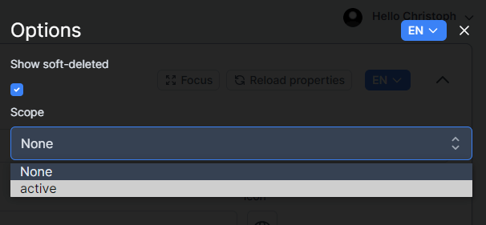
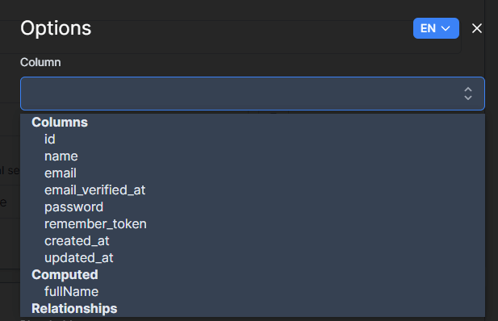

# Manipulate data

This page shows you various ways to manipulate the data shown in your BREADs.

## Scopes

You can apply a scope to every layout in a BREAD.  
The [Laravel documentation](https://laravel.com/docs/8.x/eloquent#local-scopes) shows you how to implement them.

For Voyager to recognize your scope, please make sure to follow the naming convention `scope[X]`, for example `scopeActive`.  
You can now select the scope you want to use in the layout options:


Because Voyager doesn't know which [view](views.md) you use in combination with which [list](lists.md), you **should** also apply the scope to your views to prevent users from manually setting URL parameters and using entries they are not supposed to.


## Computed properties

Computed properties allow you to display and edit properties that don't physically exist in your database.  

### Getting data

To get the data to be shown when browsing, simply create an [accessor](https://laravel.com/docs/eloquent-mutators#defining-an-accessor) as described in the Laravel docs.  
Please be aware that an accessor has to be named `get[X]Attribute` (for example `getFullNameAttribute`) to be recognized by Voyager.

### Setting data

If you want to be able to edit and/or add the data of a non-existing property, you **have** to create a [mutator](https://laravel.com/docs/8.x/eloquent-mutators#defining-a-mutator).  
The mutator also has to follow the naming `set[X]Attribute`, for example `setFullNameAttribute`.

### Using your computed property

Now that you created an accessor (and a mutator when you want to edit/add), you can simply select your accessor in the column dropdown in the `Column` dropdown.

