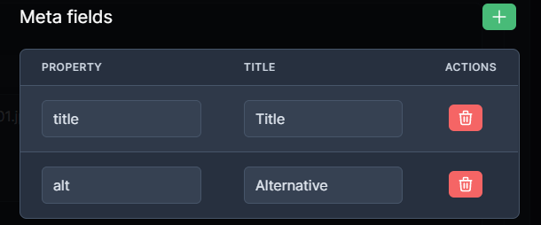

# Media Picker

The media-picker provides an easy way to use the [media manager](../../media-manager.md) as a powerful formfield for your BREADs.

## Picking files

There are two ways to pick files.  
1. Double click the file you want to pick
2. Select multiple files and hit the button "Select X files"


Files that are already picked will be removed when picking them again


## Options

### Max

Defines the maximum amount of files that can be picked.  
0 means infinity.  
When using 1 as the maximum, the currently picked file will automatically be replaced when picking another.

### Meta properties

This option lets you add simple textboxes to every picked file.  
For example, when you want to pick images, you could add a title and an alt-tag.  
Click `+` to add a new property and add the key (for example `title`) and the textbox placeholder (`Title`).

 

 


Meta properties are translatable. Simply toggle the locale and enter the translated text!


### Mime types

With this field you can decide which files can be uploaded and picked.  
Simply add a new item and insert the mime-types you want to support.  
Here are some examples:  
- image/jpg - only allow JPG images
- image/* - allow all images
- directory - display directories

When no types are defined all are allowed.  


Note that a mime-type can not be guessed for all files.  
Always consider official resources like the [official IANA MIME type list](http://www.iana.org/assignments/media-types/media-types.xhtml).


## Using media files in your model

Voyager provides a simple way to retreive files in your model.  
To use it, include the trait:

```php
<?php

namespace App;

use Voyager\Admin\Traits\HasMedia;

class MyModel
{
    use HasMedia;

    // ...
}
```

You can now call `media(field)` where `field` is the column you use in the formfield.  
`media()` will **always** return a [collection](https://laravel.com/docs/collections) containing your files.  

The following properties exist on each item in the collection:  
- Disk - The disk where the file is stored
- Path - The relative path to the disk
- Name - The name of the file
- URL - The fully qualified URL of this file

### Meta properties

Meta properties are automatically translated and injected into the items.  
If you defined a meta prop `title` you can access it like `$model->media('field')->first()->title`

### Thumbnails

When a file has thumbnails you can iterate them like:

```php
foreach ($mymodel->thumbnails as $thumbnail) {
    $thumbnail->url()
}
```

or get a thumbnail by its name like:

```php
$mymodel->thumbnails->where('thumbnail', 'crop')->first();
```