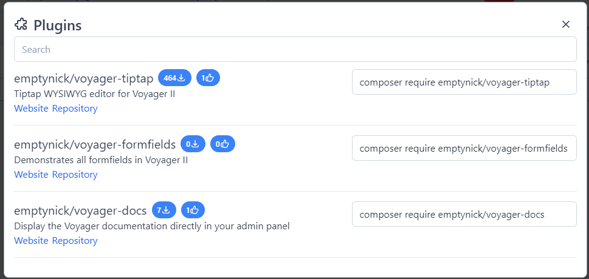

# Plugins
 
Plugins provide additional functionality for Voyager.  
They are ordinary composer packages and will be installed through the console.  

## Managing plugins

### Installation

To install a plugin, simply click `Search Plugins` and find the plugin you want to install.  
Once found, double click the textbox next to it to copy the according command to your clipboard.  
Next, open your console and run the command.  
After that, your plugin will appear on your plugins page as disabled. Click `Enable` to enable it. Your plugin is now active!  
There might be additional steps to install a plugin. Please revise the instructions by clicking the `Instructions` button or by visiting the plugin page.

 

## Plugin Types

Plugins can be of the following types, giving them special powers

### Authentication Plugins

These plugin integrate different ways to log-in to Voyager.  
For example through OAuth or social-media.  
They can also provide two-factor-authorization.

### Authorization Plugins

Authorization plugins authorize actions and users.  
Those plugins can integrate various third-party packages like `spatie/permissions`.

### Formfield Plugins

Provides additional formfields for the BREAD builder like WYSIWYG editors and other non-standard inputs.

### Generic Plugins

A generic plugin does not fit any of the other types.

### Theme Plugins

Theme plugins allow you to customize the look and feel of Voyager.  
After a theme was installed you can preview it by clicking `Preview`.  
You won't see the theme anymore after reloading your page.

 

### Widget Plugins

Widget plugins simply provide a widget which is shown on your dashboard.  
For example stats about users registered or Google Analytics.

